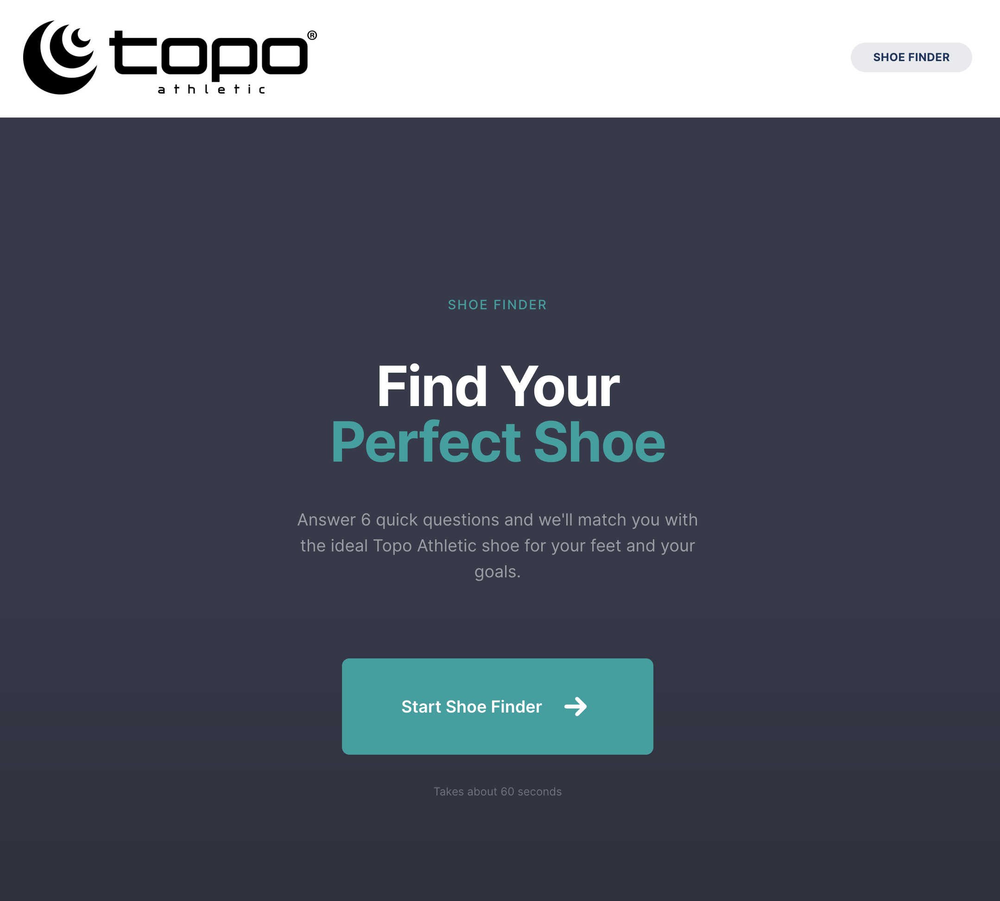
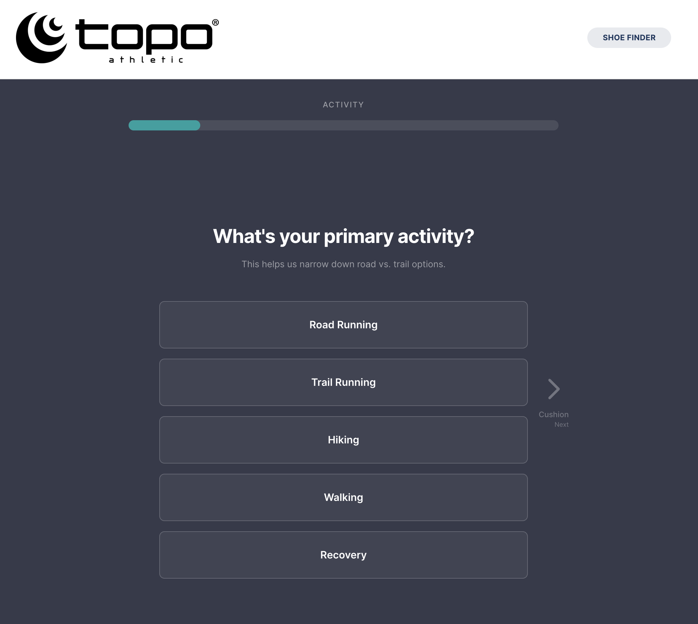
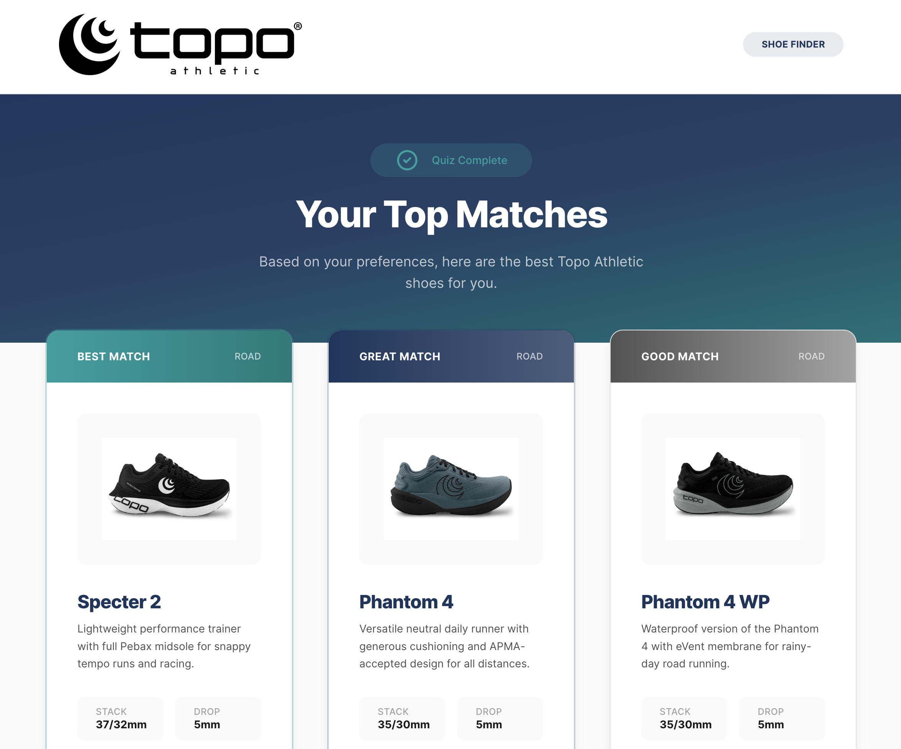

# Topo Athletic Shoe Finder

An interactive quiz-based shoe recommendation tool for [Topo Athletic](https://topoathletic.com). Answer 6 quick questions and get matched with the ideal Topo shoe for your feet and goals.

**Live:** [toposhoefinder.mikegrowsgreens.com](https://toposhoefinder.mikegrowsgreens.com)

## Screenshots

### Landing Page


### Quiz


### Results


## Features

- **6-question quiz** covering activity, cushion, terrain, support, fit, and priorities
- **20-shoe catalog** with specs verified against topoathletic.com
- **Weighted scoring engine** with activity-specific matching and hard penalties for specialty shoes
- **Mobile-friendly** full-screen quiz with smooth navigation
- **Real product images** from Topo Athletic

## Tech Stack

- **Framework:** Next.js 14.2 (App Router)
- **Language:** TypeScript
- **Styling:** Tailwind CSS 3.4
- **State Management:** Zustand
- **Deployment:** DigitalOcean, Caddy, PM2

## Getting Started

```bash
npm install
npm run dev
```

Open [http://localhost:3000](http://localhost:3000) to view the app.

## Project Structure

```
app/
  finder/
    [step]/page.tsx    # Quiz step pages (dynamic routing)
    results/page.tsx   # Results page with matched shoes
  page.tsx             # Landing page
components/
  ResultCard.tsx       # Shoe result card component
data/
  catalog.json         # Full 20-shoe catalog with specs
  images.json          # Image path mappings
lib/
  matching-engine.ts   # Scoring algorithm
  questions.ts         # Quiz question definitions
  store.ts             # Zustand state management
scripts/
  update-catalog.ts    # Auto-update scraper for catalog maintenance
```

## Build & Deploy

```bash
npm run build
```
